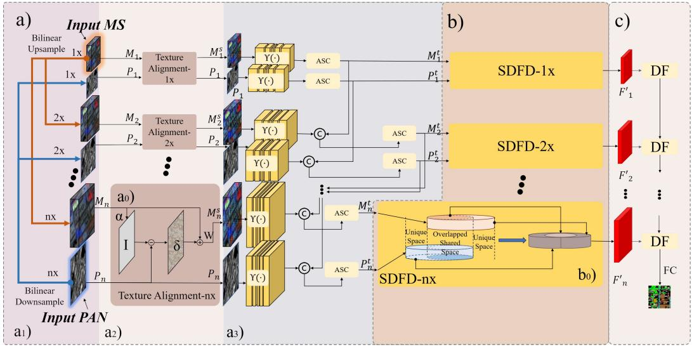

# MSAformer

##Framework of Multi-Scale Symmetric Difference Attention-Based Transformer for Panchromatic and Multispectral Classification

##Installation
Based on the Pytorch framework:

'''python

$ pip install tifffile

$ pip install opencv

$ pip install scikit-learn

$ python main.py

'''

##Config

Configs are set at the beginning of Dataprocess.py and main.py
