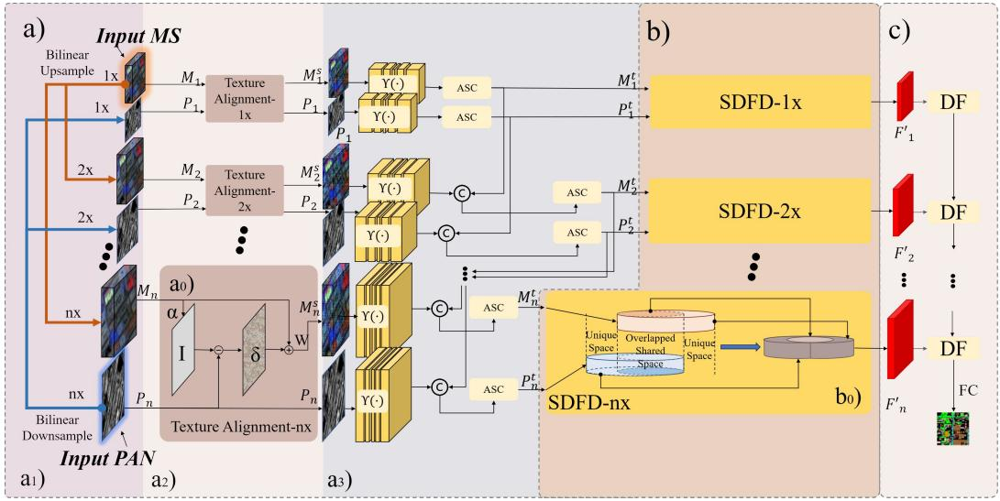

# MSAformer
## [2026.6.4] NEWS：This work has been accepted by IEEE TGRS. Coming soon to publication.
## Framework of Multi-Scale Symmetric Difference Attention-Based Transformer for Panchromatic and Multispectral Classification



## Installation
Based on the Pytorch framework:

```
$ pip install tifffile

$ pip install opencv

$ pip install scikit-learn

$ python main.py
```

## Config

Configs are set at the beginning of Dataprocess.py and main.py
